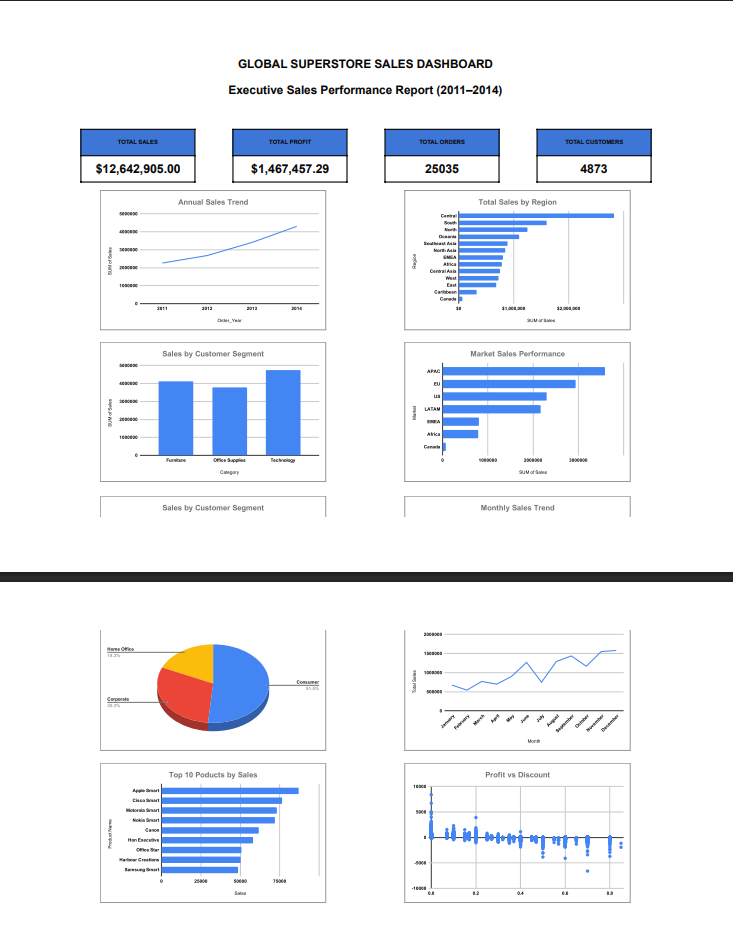
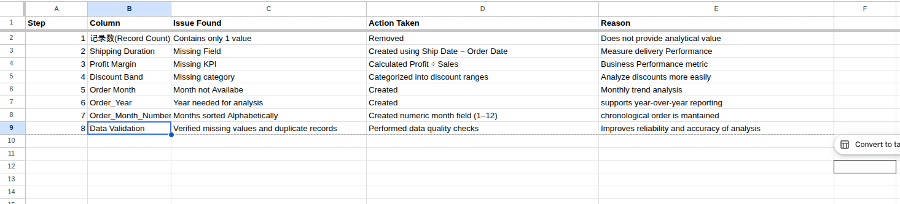
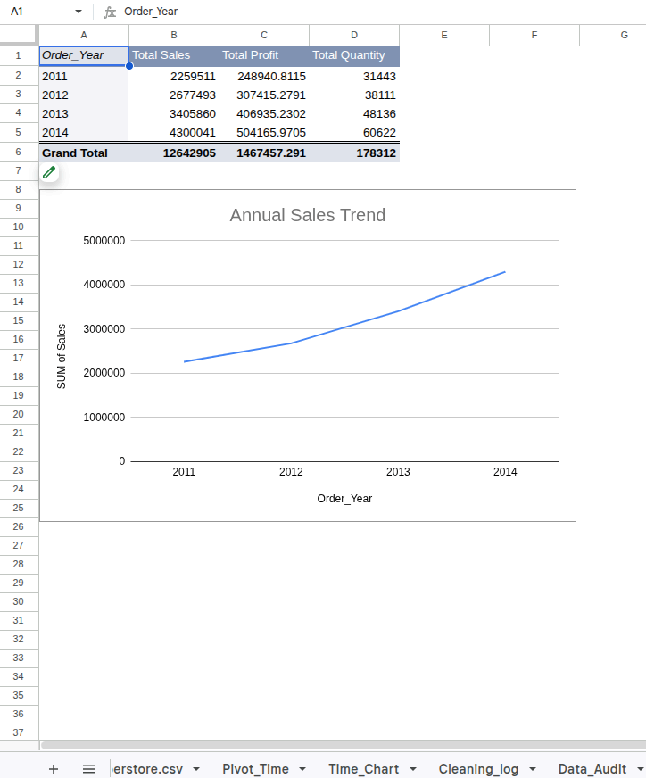
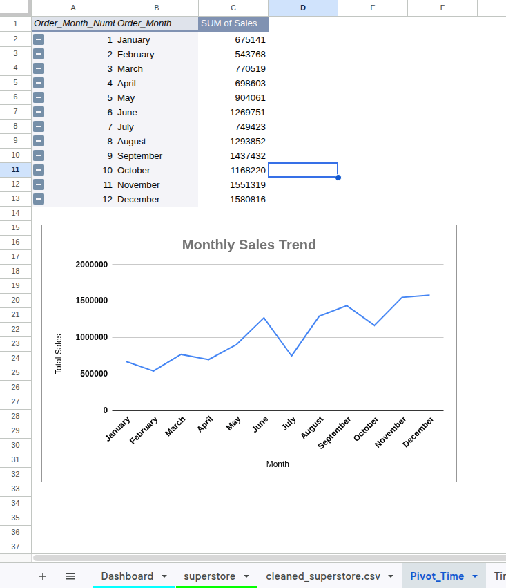
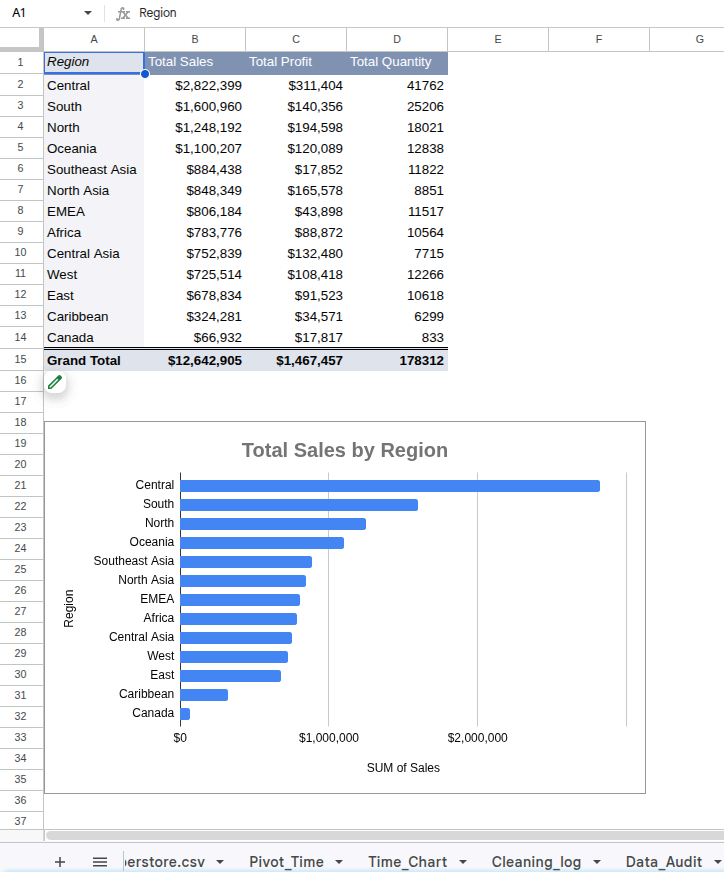
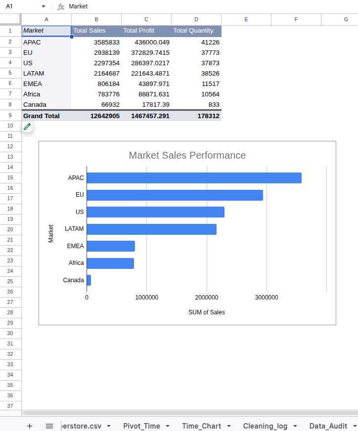
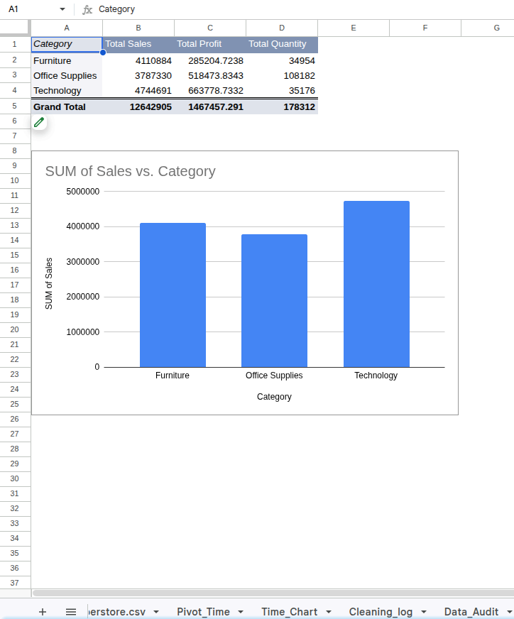
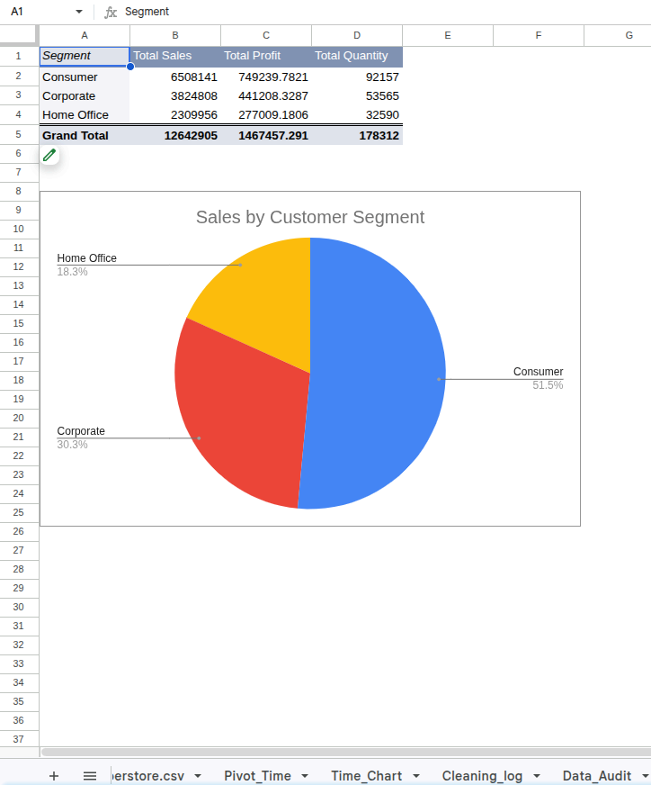
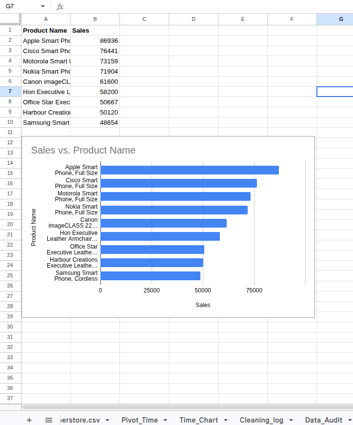

# Global Superstore Business Intelligence Dashboard

An end-to-end Business Intelligence project built in **Google Sheets** that transforms raw transactional data into an executive dashboard through data cleaning, feature engineering, pivot table analysis, and business reporting.

---

## Project Overview

The Global Superstore dataset contains four years of international sales transactions between **2011 and 2014**.

The objective of this project was to transform raw sales data into meaningful business insights that support strategic decision-making.

The project followed a complete Business Intelligence workflow, including:

- Data auditing
- Data cleaning
- Feature engineering
- Data validation
- Exploratory Data Analysis (EDA)
- Pivot Table Analysis
- Dashboard Design
- Business Reporting

---

## Business Objective

The dashboard was designed to answer key business questions, including:

- How have sales changed over time?
- Which months generate the highest revenue?
- Which markets and regions perform best?
- Which customer segments drive sales?
- Which product categories generate the most profit?
- Which products contribute the highest revenue?
- How do discounts affect profitability?

---

# Dashboard Preview



---

# Executive KPIs

The dashboard summarizes business performance using key metrics:

| KPI | Value |
|------|-------:|
| Total Sales | **$12,642,905** |
| Total Profit | **$1,467,457** |
| Total Orders | **25,035** |
| Total Quantity Sold | **178,312** |
| Unique Customers | **4,873** |

---

# Business Intelligence Workflow

```text
Raw Data
      │
      ▼
Data Audit
      │
      ▼
Data Cleaning
      │
      ▼
Feature Engineering
      │
      ▼
Data Validation
      │
      ▼
Pivot Table Analysis
      │
      ▼
Dashboard Development
      │
      ▼
Business Insights
      │
      ▼
Executive Recommendations
```

---

# Data Preparation

The dataset was cleaned and prepared before analysis.

Key activities included:

- Removing unnecessary columns
- Creating Shipping Duration
- Calculating Profit Margin
- Creating Discount Bands
- Extracting Order Year
- Extracting Order Month
- Creating Order Month Number
- Performing Data Quality Checks

### Cleaning Log



---

# Exploratory Data Analysis

Pivot Tables were used to summarize sales performance across different business dimensions.

## Annual Sales



---

## Monthly Sales



---

## Regional Performance



---

## Market Performance



---

## Product Categories



---

## Customer Segments



---

## Top Products



---

# Dashboard Features

The interactive dashboard includes:

- Executive KPI Cards
- Annual Sales Trend
- Monthly Sales Trend
- Regional Sales Analysis
- Market Sales Analysis
- Category Performance
- Customer Segment Analysis
- Top 10 Products
- Profit vs Discount Analysis

---

# Key Business Insights

- Annual sales increased from **$2.26M** in 2011 to **$4.30M** in 2014.
- Sales peaked during **November** and **December**, indicating strong seasonal demand.
- **APAC** generated the highest market revenue.
- The **Central** region recorded the highest sales.
- **Technology** was the best-performing product category.
- The **Consumer** segment contributed over **51%** of total sales.
- Higher discounts were associated with lower profitability.

---

# Repository Structure

```text
Global-Superstore-Analytics/
│
├── dashboard/
├── data/
│   ├── raw/
│   └── cleaned/
├── reports/
├── screenshots/
└── README.md
```

---

# Reports

Detailed project documentation is available in the `reports/` folder.

- Executive Summary
- Business Insights
- Business Recommendations

---

# Tools & Skills

### Tools

- Google Sheets
- Pivot Tables
- Pivot Charts

### Skills

- Data Cleaning
- Data Validation
- Feature Engineering
- Exploratory Data Analysis
- Business Intelligence
- Dashboard Design
- KPI Reporting
- Data Storytelling

---

# Author

**Alice Mercy Wanjiru Koinange**

Statistics & Programming Student | Aspiring Data Analyst

GitHub: https://github.com/Koinange-DataScience